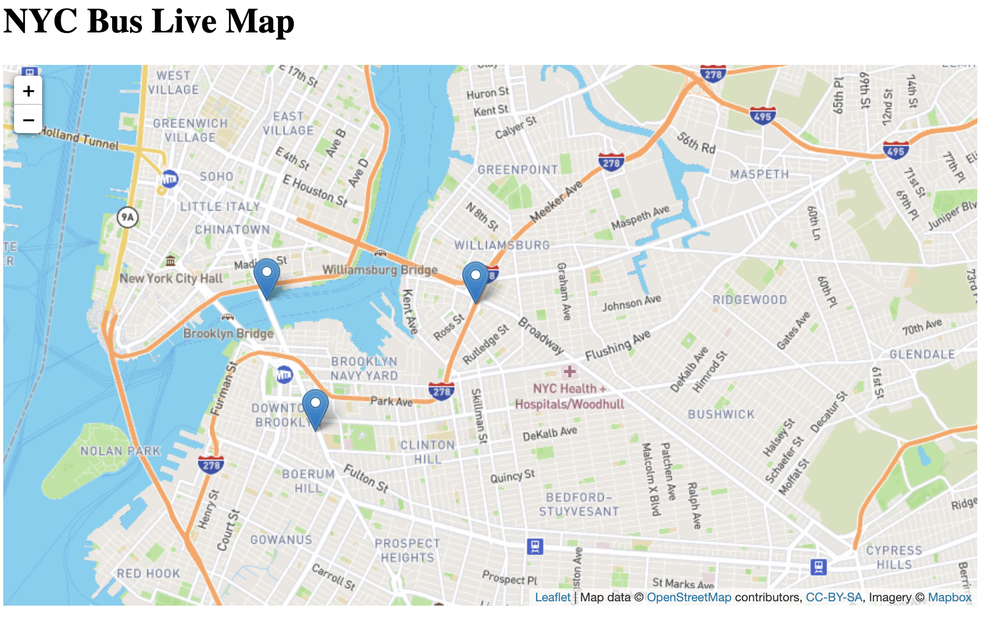
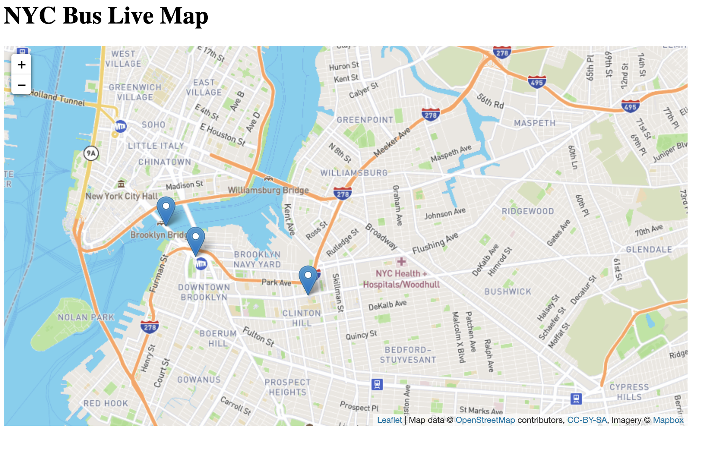

# Kafka_Live_Map

In this repo, kafka is used for tracking the route of the designed buslines.

When we run the busdata producers python files, you will see 3 different moving spots in the map. 

Environment & tools:

- Python 3.70 (pykafka, flask, JSON)
- Kafka
- Javascript (Leaflet.JS)

references:
https://github.com/code-and-dogs/liveMaps

